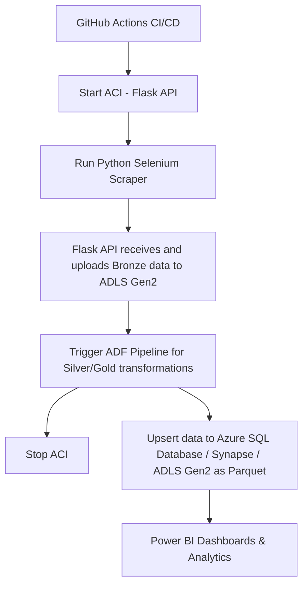

# 📈 Market Price Scraper

A Python scraper that collects stock market prices using Selenium, sends transformed data to a Flask API hosted in ACI, stores files in ADLS Gen2, triggers an ADF pipeline to upsert data into Azure SQL Database, Synapse, or save as Parquet in ADLS Gen2 following a Medallion Architecture (Bronze → Silver → Gold). Visualize insights with Power BI dashboards. Fully automated using GitHub Actions CI/CD and Docker.

---

**Table of Contents**

- [Installation](#installation)
- [Execution / Usage](#execution--usage)
- [Technologies](#technologies)
- [Features](#features)
- [Architecture](#architecture)

---

## Installation

On macOS and Linux:

```sh
$ python -m pip install -r requirements.txt
```

On Windows:

```powershell
PS> python -m pip install -r requirements.txt
```

---

## Execution / Usage

To run the scraper:

```sh
$ python scripts/run_scraper.py
```

To run the Flask API locally:

```sh
$ docker build -t flask-api:latest .
$ docker run -e AZURE_CONNECTION_STRING=<your-connection-string> -e CONTAINER_NAME=<your-container> -p 5000:5000 flask-api:latest
```

The **GitHub Actions workflow** handles:

1. Starting the ACI container with the Flask API  
2. Running the Python scraper  
3. Uploading data to **ADLS Gen2**  
4. Triggering the **ADF pipeline**  
5. Stopping the ACI container  

---

## Technologies

This project uses the following technologies and tools:

- [Python](https://www.python.org/)   
- [Docker](https://www.docker.com/)   
- [GitHub Actions](https://github.com/features/actions)   
- [Azure Container Registry](https://azure.microsoft.com/en-us/services/container-registry/)   
- [Azure Container Instances](https://azure.microsoft.com/en-us/services/container-instances/)   
- [ADLS Gen2](https://learn.microsoft.com/en-us/azure/storage/data-lake-storage/)   
- [Azure Data Factory](https://learn.microsoft.com/en-us/azure/data-factory/)   
- [Azure SQL Database](https://learn.microsoft.com/en-us/azure/azure-sql/)   
- [Azure Synapse Analytics](https://learn.microsoft.com/en-us/azure/synapse-analytics/)   
- [Parquet](https://parquet.apache.org/)   
- [Power BI](https://powerbi.microsoft.com/) 

---

## Features

- 🕵️‍♂️ Scrapes stock prices from multiple sources using Selenium  
- ☁️ Flask API receives and uploads raw data (Bronze layer) to ADLS Gen2  
- 🔄 CI/CD pipeline builds Docker images and deploys the API to ACI  
- 🔄 ADF pipeline transforms and upserts data into Silver/Gold layers, Azure SQL, or Synapse  
- 💾 Stores optimized data as Parquet for cost-efficient storage  
- 📊 Connect Power BI to Azure SQL / Synapse / Parquet for dashboards and analytics  
- 🏗 Implements Medallion Architecture (Bronze → Silver → Gold) for structured, reliable data flow


---

## Architecture



---