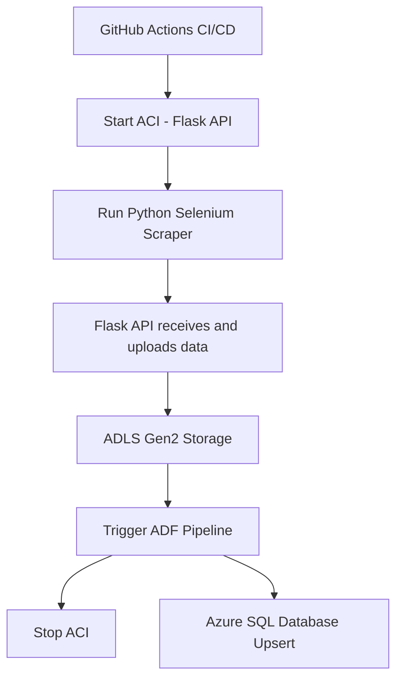

# 📈 Market Price Scraper


[](https://choosealicense.com/licenses/mit/)

A Python scraper that collects stock market prices using **Selenium**, sends transformed data to a **Flask API** hosted in **ACI**, stores files in **ADLS Gen2**, and triggers an **ADF pipeline** to upsert data into **Azure SQL Database**. Fully automated using **GitHub Actions CI/CD** and Docker.


---

**Table of Contents**

- [Installation](#installation)
- [Execution / Usage](#execution--usage)
- [Technologies](#technologies)
- [Features](#features)
- [Architecture](#architecture)
- [Contributing](#contributing)
- [Contributors](#contributors)
- [Author](#author)
- [Change log](#change-log)
- [License](#license)

---

## Installation

On macOS and Linux:

```sh
$ python -m pip install -r requirements.txt
```

On Windows:

```powershell
PS> python -m pip install -r requirements.txt
```

---

## Execution / Usage

To run the scraper:

```sh
$ python scripts/run_scraper.py
```

To run the Flask API locally:

```sh
$ docker build -t flask-api:latest .
$ docker run -e AZURE_CONNECTION_STRING=<your-connection-string> -e CONTAINER_NAME=<your-container> -p 5000:5000 flask-api:latest
```

The **GitHub Actions workflow** handles:

1. Starting the ACI container with the Flask API  
2. Running the Python scraper  
3. Uploading data to **ADLS Gen2**  
4. Triggering the **ADF pipeline**  
5. Stopping the ACI container  

---

## Technologies

This project uses the following technologies and tools:

- [Python](https://www.python.org/)   
- [Docker](https://www.docker.com/)   
- [GitHub Actions](https://github.com/features/actions)   
- [Azure Container Registry](https://azure.microsoft.com/en-us/services/container-registry/)   
- [Azure Container Instances](https://azure.microsoft.com/en-us/services/container-instances/)   
- [ADLS Gen2](https://learn.microsoft.com/en-us/azure/storage/data-lake-storage/)   
- [Azure Data Factory](https://learn.microsoft.com/en-us/azure/data-factory/)   
- [Azure SQL Database](https://learn.microsoft.com/en-us/azure/azure-sql/)   

---

## Features

- 🕵️‍♂️ Scrapes stock prices from multiple sources using Selenium  
- ☁️ Flask API receives and uploads data to **ADLS Gen2**  
- 🔄 CI/CD pipeline builds Docker images and deploys the API to ACI  
- ⏰ Scheduled execution via GitHub Actions  
- 🔄 ADF pipeline transforms and upserts data into Azure SQL Database  
- 💾 Data persisted in ADLS Gen2 for audit and reprocessing  

---

## Architecture



---

## Contributing

To contribute:

1. Fork this repository  
2. Create your feature branch (`git checkout -b feature-new`)  
3. Make your changes  
4. Commit your changes (`git commit -am 'Add new feature'`)  
5. Push to the branch (`git push origin feature-new`)  
6. Create a pull request  

---

## Contributors

- Neal Altares – [@nealaltares](https://github.com/nealaltares) – neal@example.com  

---

## Author

Neal Altares – [@nealaltares](https://github.com/nealaltares) – neal@example.com  

---

## Change log

- 1.2.3 – Workflow updated: ACI stops after triggering ADF pipeline  
- 1.2.2 – Migrated storage from Blob to ADLS Gen2  
- 1.0.0 – Initial working version with scraper and Flask API  

---

## License

This project is distributed under the MIT License. See [`LICENSE`](LICENSE.md) for details.